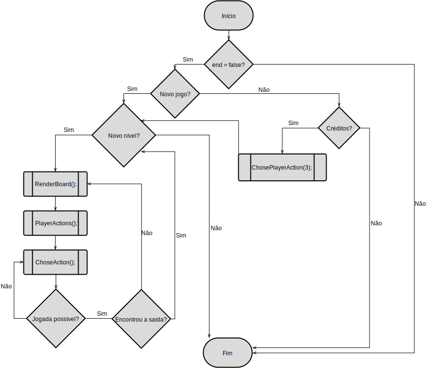

# 2º Projeto de Linguagens de Programação 1

###### Projeto realizado por:
Alejandro Urcera a21703818
Joana Marques a21701929
Pedro Santos a21702907

##### Link do repositório GitHub :

### Relatório:
O Alejandro fez a classe `Program`, `GameLoop`
A Joana fez a classe `Player`, `Exit`, `Tiles`, o fluxograma
O Pedro fez a classe `Render`, `Position`, `Board`,
O relatório foi feito por todos os elementos do grupo.

### Solução:
##### Arquitetura:
Fizemos o projeto até à fase
Separámos o código em várias classes.
Cada classe desepenha uma determinada função no código. <p>
O `Program` inicializa o jogo. <p>
A classe `Player` coloca o jogador aleatóriamente na primeira coluna da grelha e inclui também as suas ações (movimento, quit e pick object) e as restrições dos seus movimentos .  <p>
A classe `Position` contém a indicação das linhas e das colunas do tabuleiro e consequentemente, a classe `Board` tem as posições para onde o jogador se pode mover e faz o reset do mesmo. <p>
A classe `GameLoop` é o gameloop do jogo e a classe `Render` mostra os resultados. <p>
A classe `Exit` coloca aleatoriamente a saída na oitava coluna do tabuleiro e verifica se o jogador chega lá ou não. <p>
A classe `Tiles` é uma clase que herda de List e introduz o que tem cada casa do tabuleiro. <p>

As estruturas de dados que utilizámos no nosso código foi `arrays` <p>

Um dos algoritmos que usámos foi para fazer a exploração do tabuleiro:

```
public void PlayerActions(Board board)
{
    board.BoardTiles[PlayerPos.Row, PlayerPos.Column].Insert(0, this);
    board.BoardTiles[PlayerPos.Row, PlayerPos.Column].RemoveAt(10);
    board.BoardTiles[PlayerPos.Row, PlayerPos.Column].TileExploration = true;

    if (PlayerPos.Column > 0 && PlayerPos.Column < 7)
    {
        board.BoardTiles[PlayerPos.Row, PlayerPos.Column + 1].TileExploration = true;
        board.BoardTiles[PlayerPos.Row, PlayerPos.Column - 1].TileExploration = true;
    }
    if (PlayerPos.Row > 0 && PlayerPos.Row < 7)
    {
        board.BoardTiles[PlayerPos.Row - 1, PlayerPos.Column].TileExploration = true;
        board.BoardTiles[PlayerPos.Row + 1, PlayerPos.Column].TileExploration = true;
    }
    if (PlayerPos.Column == 0 && PlayerPos.Row == 0)
    {
        board.BoardTiles[PlayerPos.Row, PlayerPos.Column + 1].TileExploration = true;
        board.BoardTiles[PlayerPos.Row + 1, PlayerPos.Column].TileExploration = true;
    }
    if (PlayerPos.Column == 0 && PlayerPos.Row == 7)
    {
        board.BoardTiles[PlayerPos.Row, PlayerPos.Column + 1].TileExploration = true;
        board.BoardTiles[PlayerPos.Row - 1, PlayerPos.Column].TileExploration = true;
    }
    if (PlayerPos.Column == 7 && PlayerPos.Row == 0)
    {
        board.BoardTiles[PlayerPos.Row, PlayerPos.Column - 1].TileExploration = true;
        board.BoardTiles[PlayerPos.Row + 1, PlayerPos.Column].TileExploration = true;
    }
    if (PlayerPos.Column == 7 && PlayerPos.Row == 7)
    {
        board.BoardTiles[PlayerPos.Row, PlayerPos.Column - 1].TileExploration = true;
        board.BoardTiles[PlayerPos.Row - 1, PlayerPos.Column].TileExploration = true;
    }
    if (PlayerPos.Column == 0 && (PlayerPos.Row > 0 && PlayerPos.Row < 7))
    {
        board.BoardTiles[PlayerPos.Row, PlayerPos.Column + 1].TileExploration = true;
        board.BoardTiles[PlayerPos.Row - 1, PlayerPos.Column].TileExploration = true;
        board.BoardTiles[PlayerPos.Row + 1, PlayerPos.Column].TileExploration = true;
    }
    if (PlayerPos.Column == 7 && (PlayerPos.Row > 0 && PlayerPos.Row < 7))
    {
        board.BoardTiles[PlayerPos.Row, PlayerPos.Column - 1].TileExploration = true;
        board.BoardTiles[PlayerPos.Row - 1, PlayerPos.Column].TileExploration = true;
        board.BoardTiles[PlayerPos.Row + 1, PlayerPos.Column].TileExploration = true;
    }
    if (PlayerPos.Row == 0 && (PlayerPos.Column > 0 && PlayerPos.Column < 7))
    {
        board.BoardTiles[PlayerPos.Row + 1, PlayerPos.Column].TileExploration = true;
        board.BoardTiles[PlayerPos.Row, PlayerPos.Column + 1].TileExploration = true;
        board.BoardTiles[PlayerPos.Row, PlayerPos.Column - 1].TileExploration = true;
    }
    if (PlayerPos.Row == 7 && (PlayerPos.Column > 0 && PlayerPos.Column < 7))
    {
        board.BoardTiles[PlayerPos.Row - 1, PlayerPos.Column].TileExploration = true;
        board.BoardTiles[PlayerPos.Row, PlayerPos.Column + 1].TileExploration = true;
        board.BoardTiles[PlayerPos.Row, PlayerPos.Column - 1].TileExploration = true;
    }
}
```

##### Diagrama UML:
##### Fluxograma:


### Conclusões

### Referências
* Discussão sobre o projeto com alguns colegas de turma.
